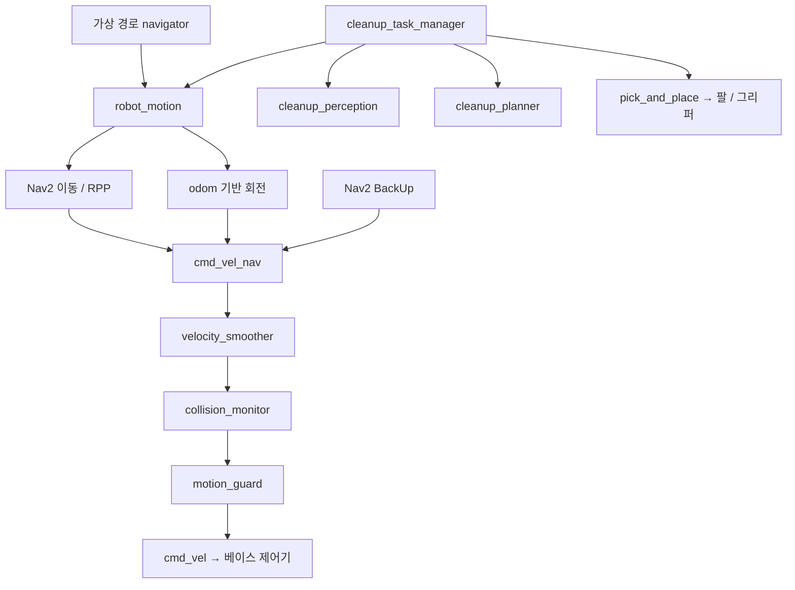

# 구조와 인터페이스

## 패키지 책임

| 패키지 | 책임 / 주요 진입점 |
| --- | --- |
| `project_bringup` | `project.launch.py` 통합 실행, `feedback_robot.launch.py`의 원본 설정을 보존하는 제어기 override |
| `aruco_localizer` | ArUco 위치 보정, 가상 경로 순회, 지도 발행, C++ depth 투영, 최종 motion guard |
| `robot_motion` | 공통 이동/엔코더 회전, 제어기 종료 시 개방, 텔레메트리/영상, 성능 설정 병합 |
| `cleanup_interfaces` | 관측 메시지와 촬영·계획·도달성·배치 서비스 계약 |
| `cleanup_perception` | 요청 기반 YOLO/SAM2, 몸통/바닥 기하, 임무 내 물체 UUID와 촬영 증거 |
| `cleanup_planner` | 검출된 UUID·허용 행동 중 선택, Gemini 응답 검증과 결정론적 fallback |
| `cleanup_task_manager` | 스테이션 순서, 관측·접근·집기·배치·복귀, 객체/임무 실패 처리 |
| `pick_and_place` | 공통 IK와 후보 계획, 팔·그리퍼 실행, 손가락 피드백, 내려놓기 |
| `ld08_driver`, `coin_d4_driver` | LiDAR 드라이버. 현재 feedback launch의 기본 분기는 `ld08_driver` |
| 보호된 세 폴더 | `realsense_bringup`: 카메라/TF, `segmentation`: 기존 모델·tracker, `turtlebot3_manipulation`: description·하드웨어·컨트롤러 |

기본 launch는 기존 연속 `segmentation_node`를 끄고 요청 기반 perception을 사용한다.
장애물 depth 투영은 YOLO와 독립된 C++ 노드 하나를 실행한다.
Python depth 실행 파일은 비교/호환용으로 남아 있으며 통합 launch에서는 실행하지 않는다.

## 주행과 제어 경로

이동과 회전은 `/motion/navigate_to_pose`, `/motion/spin`을 통한다.
실행기는 한 번에 한 목표만 받고, 취소 확인이 불명확하면 `/motion/inhibit`로 차단한다.
별도 마커 재탐색의 짧은 BackUp은 Nav2 behavior를 직접 호출하되 같은 속도 감시 경로를 지난다.
상위 두 임무를 동시에 시작하지 않는다. 단일 목표 수락은 상위 임무 전체의 상호 배제를 뜻하지 않는다.

속도 토픽 순서는 `/cmd_vel_nav` → `/cmd_vel_smoothed` →
`/cmd_vel_collision_checked` → `/cmd_vel`이다. guard가 최종 출력을 담당하고
센서 시각, TF, localization fault와 다중 최종 발행자를 감시한다.
엔코더 회전은 map 보정량을 실제 회전으로 세지 않고 odom yaw 변화량을 사용한다.

차체 제어기의 `open_loop=false`, 팔 제어기의 `open_loop_control=false`는
생성된 임시 YAML에 적용한다. velocity smoother의 `feedback=OPEN_LOOP`는
속도 평활화 설정으로, 바퀴 odometry가 open-loop라는 뜻이 아니다.

현재 경로 계획은 전역/지역 모두 `static_layer + inflation_layer`다.
지도에 없는 장애물의 자율 우회는 구현된 운용 범위가 아니며 최종 센서 계층에서 멈출 수 있다.
운반 중에는 [깊이 감시의 별도 제한](CONFIGURATION.md#운반-중-깊이-장애물-처리)이 적용된다.

## 좌표와 위치 추정

- `map/new_map_markers.yaml`: 실제 ArUco 마커의 위치/자세.
- `config/routes.yaml`: 베이스의 가상 경로/코너/주행 시험 자세.
- `cleanup_task_manager/config/task_zones.yaml`: 정리 스테이션, 베이스 배출 자세와 물체 배치점.

물리 마커 좌표, 베이스 정지점, 물체 좌표를 서로 대신 쓰지 않는다.
`aruco_localizer_node`가 `map → odom`을 보정·계속 방송하고 바퀴 odometry가
`odom → base_link`를 갱신한다. 물체 관측은 촬영 시각을 보존하며 map 좌표로 전달한다.
팔 계산에서는 TF로 `link1` 좌표로 변환한다.

| localization mode | 의미 |
| --- | --- |
| `UNINITIALIZED` | 유효한 전역 보정 전 |
| `MARKER_CORRECTED` | 최근 유효한 마커 보정 수용 |
| `DEAD_RECKONING` | 마지막 map 보정을 유지하며 바퀴 odometry로 이동 |
| `DEGRADED` | 보정 없는 이동의 시간/거리 한도 초과 또는 보정 fault |

초기화 이후 마커가 매 순간 보일 필요는 없다. 운반 중에는 마커 보정을 억제한다.
120초/8m 보정 없는 이동 한도, 센서·TF 검사와 큰 보정 차단은 유지된다.
큰 보정은 두 `map → odom`의 translation만 빼지 않고 **동일한 odom 로봇 점**에
두 변환을 적용한 위치 차이와 yaw 차이로 검사한다. fault는 원인 확인 후 재시작한다.

## 정리 임무

1. 팔 파킹 후 `scan_station_0`부터 `scan_station_5`까지 진행한다.
2. 각 스테이션에서 odom 시작 방향 기준 우회전 45°씩 8방향을 촬영한다.
   처음부터 음성인 2프레임은 사진 없이 종료한다. 양성은 최대 5프레임 중 3회 확인한다.
3. 후보 방향으로 정렬하고 정면 재관찰한 결과를 planner에 전달한다.
4. planner는 알려진 UUID와 `collect_to_drop_zone` / `skip` 중 선택한다.
   좌표·속도·팔 궤적을 생성하지 않는다. 응답 오류는 결정론적 정책으로 대체한다.
5. 팔 TF/IK로 파지·인양을 평가한다. 필요하면 정밀 접근 후 같은 UUID를 다시 촬영·평가한다.
   기본 재접근 상한은 3회다. 처음 접근 계획도 없으면 관측 자세에서 한 번 새로 확인한다.
6. `candidate_body`이고 유효기간 안인 표적만 집는다. 그리퍼 피드백, 인양, 파킹을 확인한다.
7. 기본 프로파일은 파지 후 카메라 검증을 생략하고 ID 3 바깥으로 운반한다.
8. 팔을 낮추고 개방을 확인한 뒤 후퇴·파킹한다. 수집 상태를 기록하고 원래 스테이션으로 복귀한다.

UUID는 YOLO track ID가 아닌 클래스와 map XY 거리 기반의 임무 내 identity다.
새 mission에서 registry를 초기화한다. 공간상 겹친 여러 물체의 완전한 identity는 보장하지 않는다.

한 물체의 실패는 해당 UUID를 제외하고 복구할 수 있다. 집었을 가능성이 있으면
개방과 파킹을 먼저 확인한다. 필수 이동/회전 실패, localization `DEGRADED` 등은 임무를 종료한다.
회전 액션 실패 후 스테이션 중심으로 자동 이동하는 옛 복구는 제거되었다.
성공한 회전 뒤 각도 오차가 반복해서 수렴하지 않는 경우에는 `STATION_SCAN_INCOMPLETE`로
이미 관측한 후보를 처리한다. 액션 실패와 각도 수렴 실패를 구분한다.

## ROS 계약

| 인터페이스 | 소유자 / 역할 |
| --- | --- |
| `/start_cleanup`, `/stop_cleanup` (`Trigger`) | manager의 시작/중지 요청 |
| `/cleanup/capture_objects` (`CaptureObjects`) | perception 촬영과 UUID·표적·사진 참조 반환 |
| `/cleanup/plan_objects` (`PlanCleanup`) | planner 선택과 fallback 여부 |
| `/cleanup/evaluate_grasp` (`EvaluateGrasp`) | pick의 동작 없는 도달성/접근 자세 계산 |
| `/cleanup/pick_target` (`PointStamped`) + `/execute_pick_and_place` (`Trigger`) | manager가 표적 발행 후 pick 실행 요청 |
| `/cleanup/place_object` (`PlaceObject`) | 바닥점/개방 높이를 받아 배치, `released` 상태 별도 반환 |
| `/park_arm`, `/observe_floor`, `/open_gripper`, `/close_gripper` (`Trigger`) | 실제 팔/그리퍼 동작 |
| `/cleanup/status`, `/cleanup/events`, `/pick/events`, `/motion/events` | 상태·단계 추적 |
| `/cleanup/carrying` (`Bool`, transient local) | 손가락 유지와 인양/파킹으로 확인한 운반 상태 |
| `/motion_guard/status`, `/aruco/localization_mode` | 최종 주행 허가 상태와 위치 추정 상태 |

메시지 필드의 기준은 [cleanup_interfaces](../src/cleanup_interfaces)다.
현재 pick 표적 토픽과 Trigger는 서로 다른 메시지이므로 manager에 200ms 전달 대기가 남아 있다.
통합 요청/취소 가능한 action으로 바꾸는 작업은 [리팩터링 검토](MAINTENANCE.md)에 기록했다.
