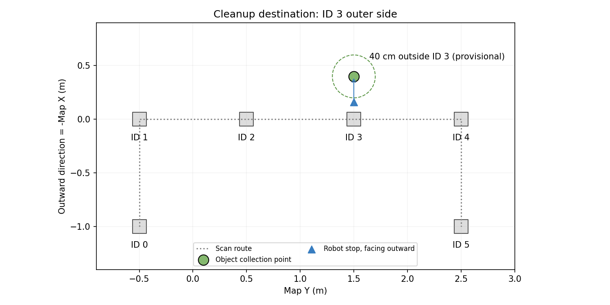

# 설정과 캘리브레이션

## 설정의 기준과 적용 순서

실행 진입점은 [project.launch.py](../src/project_bringup/launch/project.launch.py)다.
노드 기본값 위에 성능 프로파일, launch의 명시 파라미터를 적용하고, perception에는
선택한 카메라 보정 YAML을 마지막에 적용한다. Nav2·collision monitor·하드웨어 설정은
원본 YAML에 프로파일을 병합한 임시 파일을 사용한다.

| 설정 파일 | 변경할 내용 |
| --- | --- |
| [performance.yaml](../src/aruco_localizer/config/performance.yaml) | 통합 실행 기본 속도·인식·파지·운반 옵션 |
| [performance_conservative.yaml](../src/aruco_localizer/config/performance_conservative.yaml) | 낮은 주행 속도와 기존 파지 품질 조건 비교 |
| [nav2_params.yaml](../src/aruco_localizer/config/nav2_params.yaml) | RPP 제어기, 목표 허용 오차, 정적 costmap |
| [motion_safety.yaml](../src/aruco_localizer/config/motion_safety.yaml) | collision monitor 입력, 정지/접근 영역 |
| [new_map.yaml](../src/aruco_localizer/map/new_map.yaml), [new_map.pgm](../src/aruco_localizer/map/new_map.pgm) | 점유 지도와 해상도·원점 |
| [new_map_markers.yaml](../src/aruco_localizer/map/new_map_markers.yaml) | 실측 물리 마커 위치·자세 |
| [routes.yaml](../src/aruco_localizer/config/routes.yaml) | 가상 경로, 코너, 주행 시험 스테이션 |
| [task_zones.yaml](../src/cleanup_task_manager/config/task_zones.yaml) | 정리 스테이션, 스캔, UUID gate, 배출점 |
| [grasp_camera_20260906.yaml](../src/cleanup_perception/config/grasp_camera_20260906.yaml) | 통합 기본 파지 카메라 실험 보정과 주변 바닥 높이 정렬 |
| [grasp_camera_nominal.yaml](../src/cleanup_perception/config/grasp_camera_nominal.yaml) | 보정 비교용 nominal 설정 |

노드가 파일을 시작 시 읽으므로 파일 변경 후 재빌드·환경 source·브링업 재시작이 필요하다.
`install/` 안의 생성물을 직접 편집하지 않는다. 실행 중인 Python 노드도 자동 갱신되지 않는다.

## 성능 프로파일

아래 값은 코드 설정이며 실제 주행 성능 측정값이 아니다.

| 항목 | 기본 | conservative |
| --- | ---: | ---: |
| `StationPath.desired_linear_vel` | 0.16 m/s | 0.08 m/s |
| `ApproachPath.desired_linear_vel` | 0.08 m/s | 0.06 m/s |
| guard/smoother/베이스 전진 상한 | 0.18 m/s | 0.10 m/s |
| 후진 상한 | 0.05 m/s | 0.05 m/s |
| 각속도 상한 | 0.60 rad/s | 0.35 rad/s |
| 실행기 회전 상한 / gain | 0.55 rad/s / 2.0 | 0.30 rad/s / 1.0 |
| 회전 정착 / manager 스캔 대기 | 0.15 s / 0.10 s | 0.25 s / 0.35 s |
| `grasp_min_body_depth` (인식/실행 공통) | 4 mm | 6 mm |
| `approach_error_margin` (가정한 도착 오차) | 0 mm | 20 mm |
| `target_max_age` (manager/pick 공통) | 6 s | 6 s |
| `empty_scene_frames` | 2 | 2 |
| `verify_pick_with_camera` | false | false |
| `carry_clear_all_obstacles` | **true** | **true** |

두 프로파일은 CPU 최적화를 공유한다. conservative는 예전 설정 전체의 복원이나
운반 중 깊이 장애물 감시 복원을 뜻하지 않는다.

```bash
ros2 launch project_bringup project.launch.py \
  performance_config_file:=/home/user/turtlebot3_ws/src/aruco_localizer/config/performance_conservative.yaml
```

속도/가속도 변경은 guard·smoother·하드웨어를 함께 맞춘다.
[performance.py](../src/robot_motion/robot_motion/performance.py)의 `validate_profile()`이
상한 일치와 제동 모델을 검사한다. 계산 통과는 실물 정지 거리나 적재 주행의 검증을 대신하지 않는다.
일반 목표 허용 오차는 0.12m/0.20rad, 물체 접근·배출은 0.02m/0.08rad다.

## 운반 중 깊이 장애물 처리

**현재 두 프로파일 모두 운반 조건이 충족되면 모든 depth obstacle point를 비운다.**
[obstacle_depth_node.cpp](../src/aruco_localizer/src/obstacle_depth_node.cpp)의
`carry_clear_all_obstacles=true` 분기다. 기존 문서의 “잡힌 물체 주변만 제거하고
다른 depth 장애물은 유지한다”는 설명은 현재 기본 실행과 다르다.

운반 신호가 유효하고 팔이 파킹 자세에 있으며 신선한 관절 피드백으로 정지가 확인되어야 한다.
원본 depth가 유효하지 않거나 끊기면 새 cloud를 발행하지 않아 watchdog 대상이 된다.
조건이 충족되면 외부 장애물 점도 제거한 빈 cloud를 발행하고 `[CARRY_MUTED]`를 기록한다.
LiDAR와 센서/TF 시각 감시는 계속되지만 **이 구간에서 depth만 볼 수 있는 장애물의
충돌 정지는 기대할 수 없다.**

`carry_clear_all_obstacles=false`인 경우에만 아래 base_link 영역을 제거하고 바깥 점을 보존한다.

```yaml
carry_mask_min: [0.06, -0.09, 0.16]
carry_mask_max: [0.18, 0.09, 0.35]
```

이 제한적 필터 분기는 `[CARRY_SELF_FILTER]`를 기록한다.
이번 정리는 현재 기능 보존을 위해 설정을 변경하지 않았다.
운반 정책을 바꿀 때는 자기 물체로 인한 정지와 외부 장애물 보존을 함께 시험한다.

## 스테이션과 배출점

정리는 `task_zones.yaml`의 스테이션, 주행 시험은 `routes.yaml`의 스테이션을 사용한다.
현재 같은 이름의 6개 자세가 두 파일에 중복 저장되어 있으며 자동 동기화되지 않는다.
지도나 배치를 바꾸면 두 파일의 정리/주행 시험 좌표를 각각 확인한다.

| 이름 | map x (m) | map y (m) | yaw (rad) |
| --- | ---: | ---: | ---: |
| `scan_station_0` | 1.0 | -0.5 | π |
| `scan_station_1` | 0.0 | -0.5 | π/2 |
| `scan_station_2` | 0.0 | 0.5 | π/2 |
| `scan_station_3` | 0.0 | 1.5 | π/2 |
| `scan_station_4` | 0.0 | 2.5 | 0 |
| `scan_station_5` | 1.0 | 2.5 | 0 |

스캔은 8회 × -π/4, burst 최대 5프레임, 최소 3회 확인, 촬영 재시도 1회다.
YAML의 `settle_seconds=0.35`는 통합 실행 시 프로파일의 `scan_settle_seconds`로 덮어쓴다.
물체 연결은 같은 클래스의 map XY 거리 0.25m gate, 최소 신뢰도 0.45를 사용한다.
대상 거리는 0.15~2.0m 범위이며 실제 접근 거리는 팔 도달성 검사로 계산한다.

수거 위치 `marker_3_outer_collection`은 ID 3의 map -X 바깥쪽이다.

- 물체 바닥점: `placement=(-0.40, 1.50)`, `floor_height=0.0m`.
- 베이스 정지점: `(-0.16, 1.50, yaw=π)`; 물체점까지 전방 24cm.
- 개방 시 nominal TCP 높이: 35mm.
- 재수거 제외 반경: **물체점** 중심 20cm.
- ID 3에서 바깥 40cm는 **실측 미확인 가정**이다. 현장 벽과 쌓인 물체의 여유를 확인한다.



[원래 배치 스케치](collection_zone_reference.png)는 위치 관계만 나타내며 축척 도면이 아니다.

## 가상 웨이포인트 티칭

위치 추정이 정상인 상태에서 베이스를 의도한 안전 정지점에 놓고 아래 도구를 사용한다.
도구 자체는 TF를 읽고 YAML을 저장하며 주행 명령을 보내지 않는다.

```bash
ros2 run aruco_localizer calibrate_waypoints.py \
  --ros-args -p route_yaml_path:=/home/user/turtlebot3_ws/src/aruco_localizer/config/routes.yaml
```

| 입력 | 동작 |
| --- | --- |
| `p` | 저장된 자세와 미저장 측정값 목록 |
| `r scan_station_0` | 현재 `map → base_link` 자세를 기존 이름에 기록 |
| `r lower_corner_to_north` | 경로 코너의 위치와 최종 yaw 기록 |
| `s` | `routes.yaml.bak_<시각>` 백업 후 저장 |
| `q` | 종료 |

`new_map_markers.yaml`과 `task_zones.yaml`은 이 도구로 변경되지 않는다.
정리 스테이션도 옮겼다면 같은 측정값을 `task_zones.yaml`에 반영한다.
배출점은 물체 위치와 베이스 위치를 따로 측정하며 베이스 자세 확인에는 다음을 쓴다.

```bash
ros2 run tf2_ros tf2_echo map base_link
```

## 주요 launch 인자

| 인자 | 통합 기본값 / 용도 |
| --- | --- |
| `start_robot`, `start_realsense`, `start_navigation` | true; 장치·주행 시작 |
| `start_cleanup_perception`, `start_cleanup_planner`, `start_pick_and_place`, `start_cleanup_manager` | true; 정리 구성 요소 |
| `start_segmentation` | false; 기존 연속 tracker |
| `spin_command_scale` | 1.0; encoder feedback에서 과거 1.2 배율을 재사용하지 않음 |
| `cleanup_model_path`, `cleanup_sam_model_path` | `/home/user/turtlebot3_ws/src/segmentation/`의 모델 파일 |
| `cleanup_camera_calibration_file` | 설치된 `grasp_camera_20260906.yaml` |
| `gemini_model` | 코드 기본 문자열 `gemini-3.5-flash-lite`; API 가용성을 보장하는 정보가 아님 |
| `gemini_env_file` | `/home/user/turtlebot3_ws/.env` |
| `record_grasp_video` | true; 선택된 물체의 접근·파지 이벤트 영상 |

모든 인자와 설명은 노드를 실행하지 않고 조회할 수 있다.

```bash
ros2 launch project_bringup project.launch.py --show-args
```
