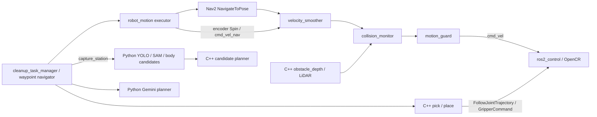

# 2026-09-06 코드 성능 개선 기록

로봇을 구동하지 않고 저장된 실험 자료, 코드, 전체 빌드, 격리된 ROS 모의 실행으로 검증했다. 기본 프로젝트 실행에 `performance.yaml`을 연결했다. 실제 주행 시간과 적재 상태의 제동 거리는 아직 측정하지 않았다. `src/realsense_bringup`, `src/segmentation`, `src/turtlebot3_manipulation` 소스는 수정하지 않았다.

**분석 근거와 실행 흐름**

변경 전 분석은 `performance_debug/analysis_before_changes.md`, 측정치는 `performance_debug/baseline.json`에 남겼다. 실제 주행 로그는 `cleanup_debug/run_20260906_183108_14777/mission.log`와 `motion_debug/run_20260906_183039_14689/telemetry.jsonl`을 사용했다. 저장된 성공 장면은 `cleanup_debug/candidate_hover_20260906_173957`이다.



| 처리 경로 | 실행 주기와 구조 | 판단 |
|---|---|---|
| ros2_control / OpenCR | C++, 100 Hz | 유지. Python 전환 대상이 아니며 임의로 serial 주기를 올리지 않음 |
| Nav2 controller / local map / BT replanning | C++, 20 / 5 / 1 Hz | 유지. 속도·감속·회전 설정의 중복 제한이 더 큰 병목 |
| motion_guard | C++, 50 Hz | 실제 timer 간격에 따른 가속 제한, 최신 cmd 하나만 보관 |
| motion_executor | Python, 50 Hz, Reentrant + 6-thread executor | 낮은 계산량의 상태 관리. C++ 전환보다 회전 수렴과 중복 대기 개선 효과가 큼 |
| ArUco localizer | C++, 카메라 프레임마다 검출 | 검출 상한 10 Hz, QoS depth=1, BGR8 입력이면 `toCvShare`로 공유. 색 변환이 필요하면 복사는 발생함 |
| 깊이 장애물 공급 | Python, 180 ms gate, 약 5 Hz | C++로 전환. 샘플링 stride=8 유지, 발행 상한 10 Hz |
| YOLO / SAM | 요청 시 Python callback → native Torch/OpenCV | 모델은 최초 로딩 후 재사용. 모델 코드와 보호된 segmentation 패키지 유지 |
| 파지 후보 / IK | Python NumPy + C++ batch subprocess | 후보당 전체 영상 반복 처리를 제거. C++ IK에 최적화 빌드를 적용 |
| Gemini planner | Python 서비스, 외부 HTTP | 이전 로그 약 3초. 네트워크/모델 대기가 중심이므로 C++로 바꿔도 이득이 작음 |
| diagnostics / video | 별도 Python 프로세스, 최신 영상 슬롯과 기록 worker | 제어 경로와 분리 유지. CPU·topic 수신율·입력 age 계측 추가 |

실제 기록의 이동 중 선속도 중앙값은 0.077 m/s였다. 45° 회전 16회의 평균은 5.05초, capture 16회의 평균은 1.72초, 물체가 없는 8방향 지점 스캔 두 회의 평균은 57.34초였다. 기존 telemetry는 4 Hz로 기록되어 센서의 실제 발행 주기를 정확히 복원할 수 없다. 현재 하드웨어 노드를 켜지 않았으므로 실물 노드별 CPU 사용률은 새로 측정하지 않았다.

**기본 성능 프로파일**

하나의 YAML을 Nav2, collision monitor, 최종 guard, Python executor, 실제 diff-drive controller에 전달한다. 기존 vendor YAML을 직접 수정하지 않고 임시 병합 파일을 만든다. cap/가속 값이 서로 다르거나 제동 모델과 collision timing이 불일치하면 launch substitution에서 거부한다.

| 파라미터 / 기능 | 변경 전 | 기본 프로파일 |
|---|---:|---:|
| `StationPath.desired_linear_vel` | 0.08 m/s | 0.16 m/s |
| `ApproachPath.desired_linear_vel` | 0.06 m/s | 0.08 m/s |
| guard / smoother / hardware 선속도 상한 | 0.10 m/s | 0.18 m/s |
| 후진 상한 | 0.05 m/s | 0.05 m/s |
| guard / smoother / hardware 각속도 상한 | 0.35 rad/s | 0.60 rad/s |
| scan `spin_max_velocity` / `spin_gain` | 0.30 / 1.0 | 0.55 / 2.0 |
| 선가속 제한 | 0.15 m/s² | 0.30 m/s² |
| 각가속 제한 | 0.40 rad/s² | 0.80 rad/s² |
| smoother / hardware 감속 크기 | 설정 계층별 상이 | 선 0.50 m/s² / 각 1.20 rad/s² |
| 접근 감속 거리 | 0.30 m | 0.18 m |
| Station 최소 접근 속도 | 0.025 m/s | 0.040 m/s |
| Station heading 회전 속도 | 0.25 rad/s | 0.50 rad/s |
| Station lookahead | 고정 | 속도 비례, 1.5 s, 0.20–0.40 m |
| scan 회전 후 encoder 안정 확인 | 0.25 s | 0.15 s |
| manager scan settle | 0.35 s | 0.10 s |
| motion admission의 정지 확인 | 매 요청 새로 0.30 s | 연속된 최신 정지 odom 이력을 재사용 |
| depth projection 발행 | 약 5 Hz | 최대 10 Hz; 입력 도착 간격에 따라 실제 주기는 달라짐 |
| ArUco 검출 | 입력 프레임마다 | 최대 10 Hz |
| 기본 초기 자세 이동 | bringup + pick 자동 초기화 | bringup이 담당, project pick의 `startup_park=false` |
| 이미 도달한 팔 목표 | 같은 3초 trajectory 재발행 | 최신 위치·속도·바닥 여유 확인 후 생략 |

코너에서는 기존 곡률 기반 감속과 cost 기반 감속을 유지한다. 장애물 충돌 검사, StopFootprint 반경 0.22 m, ApproachFootprint, LiDAR와 depth의 timeout, TF freshness/불연속 정지, 단일 최종 cmd_vel 발행자 검사를 유지한다. 일반 목표의 0.12 m / 0.20 rad, 파지 접근 목표의 0.02 m / 0.08 rad 허용 오차도 유지한다. scan을 해야 하는 지점의 정지는 작업 요구이므로 생략하지 않는다. 8방향 45° 스캔은 유지한다. 후속 사용자 요청으로 무검출은 2프레임 확인 후 사진 저장 없이 넘어가도록 변경했다. 양성 검출의 3회 확인은 유지한다.

기본 선속도 제동 모델은 반응 여유 0.70초, 감속 0.50 m/s², 거리 여유 0.05 m로 `0.18×0.70 + 0.18²/(2×0.50) + 0.05 = 0.2084 m`이다. collision 예측 1.5초 동안의 이동 0.27 m보다 작도록 설정을 검사한다. 이것은 실제 바닥 마찰·적재량·모터 응답을 검증한 결과가 아니며 회전 시 물체/팔의 swept volume을 인증하는 모델도 아니다. 실제로 감속 0.50 m/s²가 나오는지 반드시 확인해야 한다. Waffle Pi 기본 하드웨어 사양의 0.26 m/s, 1.82 rad/s를 소프트웨어 상한 검증에 사용했다. 이 사양이 매니퓰레이터 적재 주행의 안전 속도를 보증하지는 않는다. [ROBOTIS 공식 사양](https://emanual.robotis.com/docs/en/platform/turtlebot3/features/)

`performance_conservative.yaml`은 이전 이동·회전 속도로 돌아갈 때 사용한다. CPU 최적화는 유지하며, 선감속 0.20 m/s²는 현재 제동 모델을 만족하도록 설정했다. 따라서 과거 전체 설정의 완전한 복제는 아니다. 기존 실행 명령에 다음 인자만 추가하면 된다. 이 문서를 작성하면서 실행하지 않았다.

```text
performance_config_file:=/home/user/turtlebot3_ws/src/aruco_localizer/config/performance_conservative.yaml
```

**코드에서 줄인 시간과 유지한 제어 조건**

- `body_candidates`의 동일 깊이 투영/erosion을 capture 안에서 한 번만 계산한다. jaw 중심의 반경 8 pixel 깊이 샘플은 전체 1280×720 대신 여유 경계를 포함한 27×27 ROI에서 처리한다. 이미지 밖으로 잘린 물체 거부, 중심부 지지, 깊이 평면 잔차, 폭·끝 여유·IK 제약은 유지한다.
- 반복 계산이 있던 C++ IK는 새 workspace에서도 기본 `RelWithDebInfo`를 사용한다. subprocess 한 번에 모든 후보를 전달하는 기존 방식은 유지한다. 이후 subprocess 포함 15 ms 수준이므로 상시 planner 프로세스와 새 IPC 인터페이스를 추가할 이유가 작다.
- 깊이 투영만 Python→C++로 옮겼다. sampled pixel만 순회하고 출력 vector capacity를 재사용한다. 기존 `/camera/camera/color/camera_info`, `/camera/camera/aligned_depth_to_color/image_raw` 입력과 `/cleanup/obstacle_points`의 XYZ FLOAT32/header/frame을 유지한다. `16UC1`/`32FC1`, endian, row padding, 해상도별 intrinsics scaling을 지원한다. 오래된 영상과 유효 점 20개 미만은 발행하지 않아 watchdog으로 정지하게 한다. 기존 Python 실행 파일은 비교/호환용으로 남아 있으며 기본 launch는 C++ 하나만 실행한다.
- Future 완료를 기다리는 10 ms polling을 Event 완료 통지로 바꿨다. 안전 상태 확인을 위한 50 Hz loop, gripper가 실제로 물체를 잡았는지 확인하는 연속 encoder 검사/0.4초 안정 시간은 유지한다.
- 팔 startup의 고정 500 ms sleep을 최신 joint feedback 조건 대기로 바꿨다. 이미 목표인 경우에도 바닥 여유와 최신 encoder를 검사한다. 속도 정보가 없거나 아직 움직이면 정상 trajectory를 보낸다. 기본 허용 오차는 최대 0.015 rad이며 단독 node의 기본값은 0이어서 기존 동작과 호환된다.
- 팔의 전체 파지·상승 trajectory duration은 유지했다. 관절들은 원래 한 trajectory 안에서 함께 움직인다. 팔 궤적의 감속/가속 및 하중에 대한 실제 검증 없이 일괄 15% 단축하거나, 펼쳐진 팔과 base를 동시에 움직이도록 만들지 않았다. topic→Trigger 전달의 짧은 동기화 여유도 명시적 수신 확인 없이 제거하지 않았다.

**재현 측정과 성능 예상**

`OPENBLAS_NUM_THREADS=1` 환경에서 같은 저장 depth와 geometry를 사용했다. `performance_debug/benchmark.py`는 ROS를 초기화하지 않는 순수 재생 스크립트이다. `performance_debug/depth_benchmark.cpp`는 C++ 투영 함수만 측정한다. 현재 측정 결과는 `performance_debug/after.json`에 있다. CPU 시간은 프로세스의 모든 스레드 합이므로 wall time보다 클 수 있다. C++ 투영 수치에는 DDS 전송과 메시지 callback 전체 비용은 포함하지 않는다.

| 연산 | 이전 중앙값 | 이후 중앙값 | 근거 |
|---|---:|---:|---|
| body 후보 생성 | 727.1 ms | 101.8 ms | 수정 전 코드 snapshot과 같은 입력으로 paired 재측정, 10/30회 |
| 후보 IK + subprocess | 94.5 ms | 15.3 ms | 기존 baseline / 최적화 빌드 30회 |
| sampled depth 투영 | 7.64 ms Python | 0.133 ms C++ | 50/300회, 14,111개 출력 점을 서로 비교 |

성공 장면의 후보 9개는 수치 오차 `atol=1e-12`, `rtol=1e-10` 범위에서 일치했다. 최종 픽셀 `(839,543)`, pitch `-17.5°`, 보정된 link1 점 `(0.332792816, -0.048628555, -0.066932601)`을 재현했다. 몸통 중심 후보 선택과 +X 30 mm 보정은 그대로 적용된다.

긴 직선 구간은 목표 속도가 두 배여서 일정 속도 이동 부분의 시간을 약 절반으로 줄일 여지가 있다. 50 Hz·정수 속도 양자화·가감속을 넣은 단순 회전 모델은 45° 회전+admission+settle을 4.65→2.63초로 계산한다. 같은 나머지 비용을 유지하면 빈 지점 8방향 스캔은 기록 평균 57.34초에서 약 39.18초로 예상된다. `performance_debug/turn_model.json`에 가정과 결과가 있다. 관성, 바닥, 실제 DDS 지연, 초기 odom 준비, 인식/네트워크 지연이 달라질 수 있으므로 이것을 실물 완료 시간으로 보고하지 않는다. 전체 임무 시간은 이동 거리, 물체 개수, 재접근 횟수에 따라 달라진다.

**변경 파일**

| 패키지 | 주요 파일 |
|---|---|
| `aruco_localizer` | `config/performance.yaml`, `config/performance_conservative.yaml`, `launch/aruco_launcher.launch.py`, `src/motion_guard_node.cpp`, `src/aruco_localizer_node.cpp`, 새 `src/obstacle_depth_node.cpp`, 새 `include/aruco_localizer/depth_projection.hpp`, `CMakeLists.txt`, `package.xml` |
| `robot_motion` | 새 `robot_motion/performance.py`, 새 `robot_motion/process_metrics.py`, `executor_node.py`, `policy.py`, `diagnostics_node.py`, `package.xml` |
| `cleanup_perception` | `grasp_candidates.py`, `jaw_geometry.py`, `perception_node.py` |
| `cleanup_task_manager` | `src/cleanup_task_manager_node.cpp`, `CMakeLists.txt` |
| `pick_and_place` | `src/pick_and_place_node.cpp`, `CMakeLists.txt` |
| `project_bringup` | `launch/project.launch.py`, `launch/feedback_robot.launch.py`, `package.xml` |
| 회귀 검사 | depth projection C++/ROS, safety 두 profile, launch overlay, 성능 profile 검증, CPU accounting, jaw ROI, executor 두 profile, park 중복 방지 테스트 추가/수정 |

**검증 기록과 환경 제한**

전체 20개 패키지를 `colcon build --symlink-install --parallel-workers 2 --cmake-args -DCMAKE_BUILD_TYPE=RelWithDebInfo`로 빌드했다. Python 문법은 src 전체 AST로, package.xml은 XML 파싱과 dependency 조회로 확인했다. 실제 project launch의 `--show-args`와 launch substitution 테스트를 통과했다. `ros2_control`이나 실제 카메라/모터 노드는 테스트에서 시작하지 않았다. ROS 실행 검사는 localhost와 격리된 domain에서 fake controller/sensor만 연결했다.

주요 검사: perception 39개, robot_motion 14개, pick mock 8개, mission mock 21개, launch overlay 2개, depth/safety ROS 3개 및 C++ 기구학·localization·route·Nav2 설정 검사를 통과했다. Python 패키지의 flake8/pep257도 포함한다. 상세 기록은 `performance_debug/*tests*.log`, `*_test_results.log`, `build_verified.log`를 참고한다. 개발 환경의 사용자 pytest plugin과 시스템 pytest 버전이 충돌하여 검사 명령에 `PYTEST_DISABLE_PLUGIN_AUTOLOAD=1`을 사용했다. executor 테스트는 action 객체를 shutdown 전에 명시적으로 해제하고, lint는 native ROS 상태를 fork하지 않도록 한 프로세스에서 실행한다.

변경한 6개 패키지의 `rosdep check`는 통과했다. 전체 workspace 검사에는 보호된 기존 패키지의 `opencv2`/`pytest` rosdep key와 `pcl_ros` 미충족 선언이 남아 있다. 이번 변경 경로의 빌드와 의존성 확인을 막지는 않았으며 해당 보호 패키지를 고치거나 시스템 패키지를 임의 설치하지 않았다. 기존 `segmentation` packaging 경고, 최초 최적화 빌드에서의 사용하지 않는 coin LiDAR driver 경고 등은 원본 로그에 보존했다.

**다음 실물 실행에서 확인할 항목**

1. 팔이 초기 자세인 상태에서 짧은 직선, 90° 코너, 목표점 접근을 확인한다. profile을 비교하면서 odom의 실제 선속도·각속도와 이동 시간을 비교한다.
2. 실제 감속, 정지 거리, 센서 age를 확인한다. 기본 모델이 전제한 0.50 m/s² 제동이 나오지 않으면 먼저 속도를 낮추거나 제동 모델/충돌 예측 여유를 늘린다.
3. ArUco correction 지연/오차와 `map→odom` 안정성, 45° 회전의 ±0.025 rad 수렴을 확인한다. 카메라/깊이의 실제 처리 주기가 CPU 부하에도 유지되는지 본다.
4. ID=2 물체의 전체 8방향 검출, 비스듬한 바나나 중심 후보, 30 mm 보정, 파지→상승→수거 위치 배치를 확인한다. 적재 주행에서는 미끄러짐과 흔들림도 확인한다.
5. `motion_debug/.../telemetry.jsonl`의 `kind=performance`에서 프로세스 CPU/RSS, topic 수신 Hz, 최대 입력 age를 확인한다. 이는 프로세스 단위이며 한 프로세스의 여러 ROS node를 개별 CPU로 분리하지 못한다. `/cmd_vel` 메시지에는 header가 없어 수신율만 기록한다. `[DEPTH_PERF]`, `[CAPTURE_PERF]` 로그로 callback/요청 wall time과 CPU를 비교한다.
6. 최초 baseline과 같은 경로/물체 배치에서 전체 임무 시간을 비교한다. 경로 단축이나 더 높은 제어 주파수는 실제 비용과 추종 오차를 보고 결정한다.

더 빠르게 조정할 때는 `StationPath.desired_linear_vel`, `spin_max_velocity`, `spin_gain`, 선/각 가속, `approach_velocity_scaling_dist`, lookahead를 우선 비교한다. guard/smoother/hardware cap과 가속은 함께 바꾸어야 한다. `ApproachPath` 속도와 최종 오차는 정밀 파지에 직접 영향을 주므로 별도로 검증한다. `image_processing_rate`를 다시 높일 때는 ArUco CPU와 TF 주기를 함께 확인한다. 충돌 검사, stale 입력 정지, gripper hold 검증을 끄는 방식으로 시간을 줄이지 않는다.


**후속 요청: 무검출 정지와 사진 저장 축소**

사용자가 실행 중인 로봇은 재시작하거나 제어하지 않았다. 45도 간격은 저장된 RGB intrinsics의 가로 시야 70.22도에서 관측 영역을 겹치기 위한 설정이다. 회전 후 대기는 정지 확인, manager settle, 새 RGB-D 프레임 수신과 YOLO 반복으로 구성되며, 무검출 사진은 디버깅을 위해 저장하던 것이다.

`scan_perception_node.empty_scene_frames=2`를 두 성능 프로파일에 추가하고 project perception node에도 프로파일을 연결했다. 처음부터 대상 YOLO 검출이 없는 경우 두 프레임 후 성공/빈 관측으로 응답하여 다음 방향으로 진행한다. JPEG와 JSON을 저장하지 않는다. 한 번이라도 대상이 보이면 깊이가 무효여도 무검출로 간주하지 않고 기존 최대 5프레임·3회 확인 및 정밀 처리 경로를 유지한다. 프레임 부족과 추론 오류는 무검출 성공으로 처리하지 않는다. 확인을 늘리려면 `empty_scene_frames`를 5로 바꿀 수 있으며 사진 저장은 여전히 생략된다.

무검출 때의 추론 횟수는 5→2로 60% 줄지만, 센서 도착/추론 속도 때문에 짧은 정지는 남는다. 앞서 기록한 39.18초 회전 모델은 이 후속 변경 전 5프레임 비용을 유지한 가정이다. 이번 변경의 실물 완료 시간은 측정하지 않았다. 실행 중 Python 프로세스에는 코드가 자동 반영되지 않으며 다음 perception node 시작부터 적용된다.
